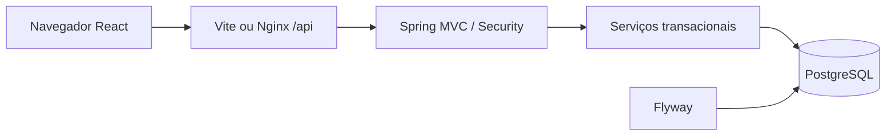
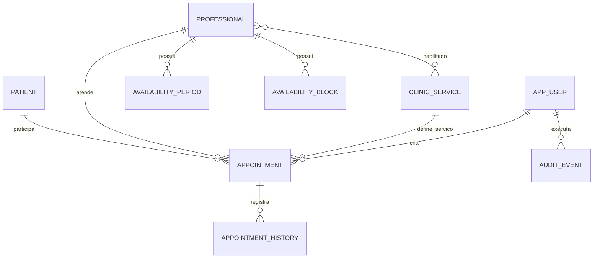

# Arquitetura e regras

## Componentes

Um monólito por clínica. Java 21 e Spring Boot 3.5.16, escolhido após consulta à documentação oficial da linha estável e sua compatibilidade com Java 21. Controllers recebem DTOs explícitos. Serviços aplicam regras. Repositories persistem. A interface reflete o resultado confirmado da API.

## Entidades

`ClinicSettings` é único. Os horários de consulta preservam sua duração original. Datas de nascimento são datas civis; agendamentos são instantes, apresentados em America/Sao_Paulo.

## Permissões

| Ação | Público | RECEPCAO | ADMIN |
|---|---|---|---|
| Ler conteúdo aprovado | Sim | Sim | Sim |
| Pacientes: consultar/criar/editar/inativar | Não | Sim | Sim |
| Agendamentos: consultar/criar/reagendar/status | Não | Sim | Sim |
| Consultar profissionais/serviços/disponibilidade | Somente conteúdo publicado | Sim | Sim |
| Editar profissionais/serviços/disponibilidade | Não | Não | Sim |
| Excluir cadastro sem vínculo | Não | Não | Sim |
| Usuários e configurações | Não | Não | Sim |
| Alterar a própria senha | Não | Sim | Sim |

Todas as permissões devem ser verificadas no servidor. Ocultar um botão não substitui autorização. Não há cadastro público de contas.

## Agenda

Início futuro; duração positiva; cadastros ativos e serviço autorizado ao profissional. A consulta inteira precisa estar dentro de um período disponível e fora dos bloqueios. Intervalos usam a convenção `[início, fim)`: consultas adjacentes são possíveis, sobrepostas não. Conflitos do paciente também são impedidos.

Cancelamentos liberam o horário, mantendo histórico. Reagendamento volta ao estado AGENDADO. CONCLUIDO, CANCELADO e NAO_COMPARECEU são finais. Conclusão e falta só após o término. Registros com vínculos não são apagados. Inativação ou mudanças de disponibilidade não podem invalidar silenciosamente consultas futuras.

O backend usa controle transacional e restrições no PostgreSQL para que requisições concorrentes não reservem o mesmo intervalo. Edições incluem `version`, e conflitos retornam HTTP 409. Detalhes da estratégia concreta e seus testes ficam junto ao código backend e em verification.md.

## Referências técnicas

- https://docs.spring.io/spring-boot/3.5/system-requirements.html
- https://docs.spring.io/spring-security/reference/servlet/exploits/csrf.html
- https://docs.spring.io/spring-boot/how-to/data-initialization.html
- https://docs.spring.io/spring-framework/reference/web/webmvc/mvc-ann-rest-exceptions.html
- https://www.w3.org/WAI/ARIA/apg/patterns/dialog-modal/
- https://www.w3.org/WAI/WCAG21/Techniques/aria/ARIA22
